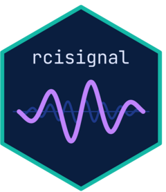
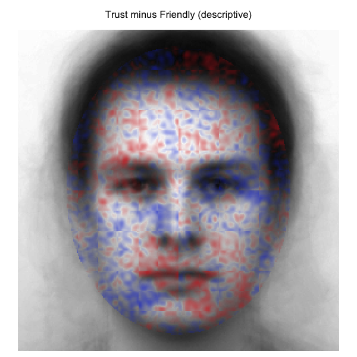
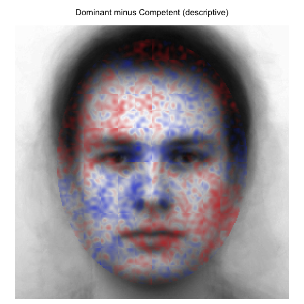
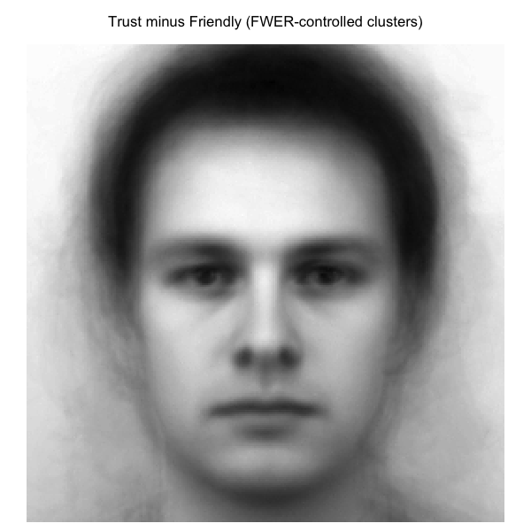
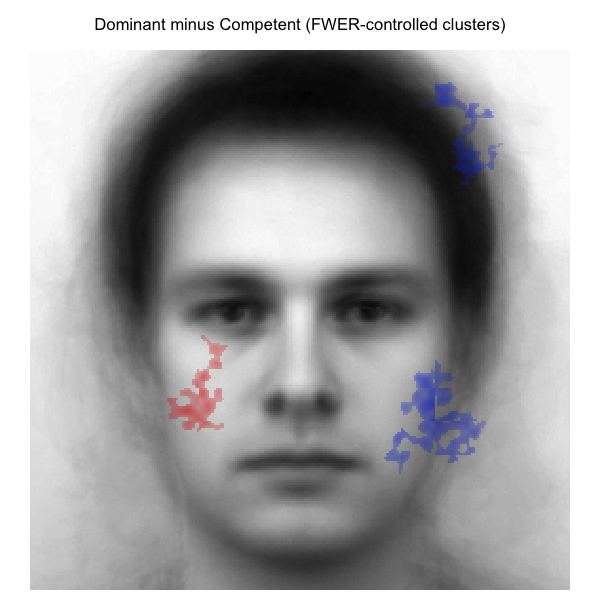

{fig-align="center"}

If you've ever run a reverse correlation (RC) experiment, you've probably lived this moment before: you feed your data into the classification image (CI) generation pipeline, look at the output, and something just feels *off* (but apparently nothing technically broke). You see no errors or warnings, just a CI that *looks* plausible (don't we all more easily see what *we want* to see! ;) ) and yet something just doesn't quite add up, or output values that look higher or lower than you would expect in theory.

More often than not, the issue is not with your theory, but with your data pipeline. So...time for some data pipeline plumbing! Put on your Super Luigi hat and *let'sa gooo!* (sorry Mario, Luigi is way cooler!)

**BUT** even when your input data is perfectly clean, you still cannot tell, just by looking at a CI, whether it is **reliable** (would the same participant's data produce a similar CI on another day?) or **discriminable** (does this CI actually look different from the CI of a comparison condition, beyond what you'd expect from noise alone?). Some papers in the Social Psychology RC literature analyze how CI pixels of different representation target condition correlate to assess similarity, and some venture into pixel cluster analyses, but tools to facilitate such analyses remained buried in lab drawers (perfectly understandable! There is often just no time worth spending in walking the extra mile of converting study scripts into a software development odyssey).

After repeatedly running into all these questions in the past years (both in my own projects and when helping others), I decided to put it all in one toolkit. After some iterations and interim package projects I decided to compile everything into a bigger package baptized as [**`rcisignal`**](https://github.com/olivethree/rcisignal), which I am now sufficiently happy to release publicly (v0.1.0).

## What it does

`rcisignal` is an R package that bundles three things you should be doing on every RC dataset before you commit to an interpretation, but which are usually scattered across personal scripts (when they get done at all):

-   **Data-quality diagnostics** on your trial-level response data, *before* you compute any CIs. Call `run_diagnostics()` and get back a clear **pass / warn / fail / skip** report per check.
-   **Pixel-level reliability and dissimilarity analyses** on the CIs themselves: does each condition agree internally? Are two conditions actually different, with proper FWER control over the pixel grid?
-   **InfoVal diagnostics** for individual-level signal magnitude, with a reference distribution that's keyed on *each producer's actual trial count* (this matters a lot for Brief-RC; more on that below).

It supports both of the pipelines that currently dominate the field:

-   **Two-image forced choice (2IFC)**, the classical reverse correlation paradigm implemented in the [`rcicr`](https://github.com/rdotsch/rcicr) package (Dotsch, 2016, 2023).
-   **Brief-RC**, the more recent variant introduced by [Schmitz, Rougier, and Yzerbyt (2024)](https://doi.org/10.1002/ejsp.3100) that shows 12 or 20 noisy faces per trial instead of two.

A single `method` argument decides which pipeline you're working in; the rest of the API is shared.

## Data-quality diagnostics: what the checks actually catch

Here's a flavor of what comes out of `run_diagnostics()`. Every finding lands in one of four buckets (**pass**, **warn**, **fail**, **skip**), and each check names the participants or trials involved so you can jump straight to fixing them.

-   **Response coding.** Are responses `{-1, +1}` as the pipeline expects, or accidentally `{0, 1}` from your data-collection tool? This is easy to miss and it silently halves your CI.
-   **Trial counts.** Does every participant have the number of trials you expected? Participants who terminated early or whose data got partially lost skew your group-level CIs.
-   **Stimulus alignment.** Do the stimulus IDs in your response data actually exist in your stimulus pool, and are they within range? Off-by-one errors here are surprisingly common and hard to spot visually.
-   **Response bias.** Are some participants just clicking the same side over and over? These produce near-constant "CIs" that carry no signal.
-   **Reaction times.** Any participants with an unusually high rate of extremely fast responses? Likely rushed or inattentive trials that contaminate the CI.
-   **Duplicates.** Is the same trial somehow recorded twice? Rare but happens with concatenated session files.
-   **Version compatibility.** Is your `.Rdata` parameter file from the same `rcicr` version you're now trying to analyse with?
-   **Response inversion.** Does a participant's CI look like its own mirror image? A small but real fraction of participants get confused about which face they're supposed to be picking, and their "inverted" CIs cancel out everyone else's.

If everything passes, you can move on to generating CIs and computing reliability with confidence. If something fails, the report tells you exactly which participants or rows to investigate before you continue. For Brief-RC users, `validate_noise_matrix()` is a separate one-shot check that confirms your noise matrix dimensions are consistent with what your responses assume.

## Reliability and dissimilarity

Once your input data is clean and you have per-participant CIs, some questions often worth asking are:

-   Do participants *within* a condition agree with each other (reliability)?

-   And are participants *across* two conditions actually responding to different things (discriminability)?

`rcisignal` includes a family of functions for these:

-   **`run_reliability()`** is the high-level "is this condition internally coherent?" entry point. Internally it stitches together split-half permutation tests, ICC(3,*) (with a guard on which form to use given your trial budget), leave-one-out producer agreement, and a pixel-wise* t\*-map vs the empirical null. The output prints as a one-page report with all four numbers and a verdict.
-   **`run_discriminability()`** asks the corresponding "are these two conditions actually different?" question. It produces a **cluster-agreement map**: a neuroimaging-style FWER-controlled pixel map of where two CIs differ, with the cluster threshold and permutation count fully configurable. Use `run_discriminability_pairwise()` for an *n*x*n* grid of contrasts when you have more than two conditions.
-   **`pixel_t_test()`** and **`agreement_map_test()`** are the lower-level building blocks if you want to compose the analysis yourself, e.g. with custom face masks or non-default cluster-forming thresholds.
-   **`rel_dissimilarity()`** computes between-CI Euclidean / Frobenius dissimilarities with a percentile-bootstrap CI, which is a more honest "effect size" for between-condition differences than just eyeballing two CIs side-by-side.
-   **The `plot_*` family** (`plot_agreement_map()`, `plot_dissimilarity_grid()`, `plot_ci_overlay()`, `plot_face_mask()`) gives you publication-ready figures without needing to wrangle `image()` calls by hand.

These analyses can help you gather more evidence about *whether* and *where* the people actually producing the CIs actually agreed. This can be triangulated with the subjective trait ratings of the resulting CIs by other new participants who did not produce the CIs in an RC task. This is especially useful to overcome some known limitation of the phase 2 of trait ratings of group-level CIs (see Cone et al., 2021).

## InfoVal and its distributions

A question that some colleagues venturing into RC methods bumped into and struggled with over the past few years was whether a low or negative individual-level **infoVal** score (introduced by Brinkman et al., 2019) means the data are broken or the metric is just noisy. `rcisignal` ships three functions that try to make that question answerable instead of guessable:

-   **`infoval()`** computes per-producer infoVal with a reference distribution keyed on *each producer's actual trial count*. This closes a calibration gap in the original `rcicr::computeInfoVal2IFC()`, which keys the reference on pool size and biases Brief-RC infoVals downward.
-   **`make_face_mask()`** generates the oval face-region masks used by [Schmitz et al. (2024)](https://doi.org/10.1002/ejsp.3100), and the sub-regions: eyes, nose, mouth, upper / lower face. Pass it to the infoVal computation to restrict the Frobenius norm to the face area instead of integrating over hair and background.
-   **`diagnose_infoval()`** is a guided diagnostic that runs in six steps: simulate the reference at every trial count in the data, sanity-check it with a random responder, compute per-producer z unmasked, compute it masked, compute the group-mean CI's z, and tally the per-producer distribution. The report explains what to look at first and what is honest to put in a methods section. Both 2IFC and Brief-RC are supported natively.

The user's guide has a chapter on what infoVal scores actually look like in published 2IFC and Brief-RC studies (the answer depends on paradigm and target, more than people often assume).

## Testing it on real data: Oliveira et al. (2019)

To make the output concrete, here are two contrasts from the open data of [Oliveira, Garcia-Marques, Dotsch & Garcia-Marques (2019)](https://doi.org/10.1002/ejsp.2569). In Study 1, 200 participants completed a 2IFC reverse-correlation task on a 256 x 256 grayscale male base face across 10 trait conditions (20 producers per trait, 300 trials each). The four traits highlighted here are **Trustworthy**, **Friendly**, **Competent**, and **Dominant**.

The motivating prediction was that the **Dominant vs Competent** contrast would yield broader pixel-level differences than the **Trustworthy vs Friendly** contrast. Trustworthy and friendly both load on the warmth dimension and share much of their facial encoding; dominant and competent are usually thought of as agency-related but have been argued to dissociate, with dominance reading off coarser whole-face features and competence reading off subtler ability cues.

### Descriptive cluster-agreement maps

Difference of the two group-mean CIs across all face-oval pixels; no inferential filter applied. Blue = first condition stronger; red = second condition stronger; opacity = magnitude of the difference.

|  |  |
|------------------------------------|------------------------------------|
| **Trustworthy − Friendly** | **Dominant − Competent** |
| {alt="Descriptive map: trust minus friendly"} | {alt="Descriptive map: dominant minus competent"} |

### FWER-controlled cluster-agreement maps

Same difference signals, but pixels outside any cluster significant at *p* \< .05 are transparent (cluster threshold \|t\| \> 2.0; 2000 stratified label permutations; max-mass null).

|  |  |
|------------------------------------|------------------------------------|
| **Trustworthy − Friendly** | **Dominant − Competent** |
| {alt="FWER map: trust minus friendly"} | {alt="FWER map: dominant minus competent"} |

The two contrasts pick out qualitatively different spatial signatures, broadly consistent with the prediction. Trustworthy versus Friendly localizes around the eyes and mid-face (exactly the kind of socially-relevant feature region the warmth dimension is read off). Dominant versus Competent spreads more widely across the face, consistent with a contrast that draws on both whole-face agency cues and finer ability cues. Among the pixels that survive the FWER filter, the Dominant vs Competent map retains noticeably more spatial extent than the Trustworthy vs Friendly map.

### Per-region infoVal

Magnitude per producer also varies by face region. The grid below runs `infoval()` separately on each (trait, region) cell using the [Schmitz et al. (2024)](https://doi.org/10.1002/ejsp.3100) face masks and the trial-count-matched reference distribution. Cells report **median producer z-score** and (in parentheses) **how many of 20 producers cleared the conventional `z >= 1.96` threshold**.

| Trait       | Full face    | Upper face   | Eyes         | Mouth        |
|-------------|--------------|--------------|--------------|--------------|
| Trustworthy | +0.50 (3/20) | +0.30 (2/20) | +0.62 (0/20) | +0.53 (3/20) |
| Friendly    | +0.97 (5/20) | +0.23 (2/20) | +0.09 (2/20) | +0.75 (4/20) |
| Competent   | +0.70 (3/20) | +0.21 (3/20) | +0.24 (2/20) | +0.25 (5/20) |
| Dominant    | +0.89 (6/20) | +0.37 (5/20) | +0.76 (3/20) | +0.38 (2/20) |

The per-region picture is more granular than the headline full-face number suggests. Dominance carries comparatively strong signal in the **eyes** and **upper face** but only modest signal around the **mouth**; friendliness flips the pattern, with the **mouth** carrying its strongest regional signal and the **eyes** the weakest. Trustworthy localizes broadly across the eyes and mouth without a clear regional peak. The full per-region grid, the bootstrap dissimilarity intervals that accompany it, and the methods-section reporting templates are in vignette §12 of the [user's guide](https://olivethree.github.io/rcisignal/articles/rcisignal.html).

Looking at these results was quite a thrill. This was my first published paper of my PhD project. It was published a long time ago, in a world where the infoVal metric was not yet established, there was no clear understanding of the limitations of Phase 2 trait ratings using group CIs, and I was but a young apprentice learning the new ways of doing research post-reproducibility crisis. My mind was spinning with neurotic thoughts like: *What if the results do not replicate with a more scrutinized data pipeline? What if the infoVals suggest none of my CIs in that paper had any signal? What if the reliability analyses show no agreement?*

Lucky me...the pattern of results was not only replicated, BUT extended to a new level of insights about the data. What a ride! Anyway...this could be useful for any meta-analysis enthusiasts out there ;)

## Quick look

For your own data, the minimum you need is a response CSV with `participant_id`, `stimulus`, and `response` columns (optionally `rt`), plus either an `rcicr` `.Rdata` for 2IFC or a noise matrix for Brief-RC:

```{r eval=FALSE}
# install.packages("remotes")
remotes::install_github("olivethree/rcisignal")

library(rcisignal)

# Don't have data yet? Two helpers generate a complete simulated dataset
# (responses + noise pool) so you can try every step below right away:
#   sim <- simulate_2ifc_data()        # 50 x 2 producers, 500 trials each
#   sim <- simulate_briefrc_data()     # Brief-RC equivalent
# then pass sim$data and sim$rdata_path everywhere "responses" / "rdata" appear.

# 1. Diagnose the raw data first
responses <- read.csv("path/to/responses.csv")
report    <- run_diagnostics(
  responses,
  method = "2ifc",
  rdata  = "path/to/rcicr_stimuli.Rdata",
  col_rt = "rt"
)
print(report)

# 2. Within-condition reliability
trustworthy   <- ci_from_responses_2ifc(trust_responses,   "data/rcicr_stimuli.Rdata", "base")
untrustworthy <- ci_from_responses_2ifc(untrust_responses, "data/rcicr_stimuli.Rdata", "base")
print(run_reliability(trustworthy$signal_matrix,   seed = 1))
print(run_reliability(untrustworthy$signal_matrix, seed = 1))

# 3. Between-condition discriminability
result <- run_discriminability(
  trustworthy$signal_matrix,
  untrustworthy$signal_matrix,
  seed = 1
)
print(result)
plot(result)
```

That's it! A full walkthrough, including how to interpret cluster maps, sample-size warnings, when to use ICC(3,1) vs ICC(3,k), and Brief-RC end-to-end, can be found in the package's [user's guide](https://olivethree.github.io/rcisignal/articles/rcisignal.html).

## Status and what's next

The latest release version can be checked by clicking the Zenodo DOI badge at the title section. The API is not yet frozen, I expect to keep refining functions based on feedback I might get in the coming months, so please indicate the current version if you use it in any of your work. Distribution is GitHub-only, and I have no CRAN plans, as working on RC methods stuff is mainly a "hobby" beyond my daily job research focus.

Feedback, bug reports, and feature requests are very welcome.

Thanks for reading!

## Links

-   **Package on GitHub**: <https://github.com/olivethree/rcisignal>
-   **User's guide**: <https://olivethree.github.io/rcisignal/>

## References

-   Brinkman, L., Goffin, S., van de Schoot, R., van Haren, N. E. M., Dotsch, R., & Aarts, H. (2019). Quantifying the informational value of classification images. *Behavior Research Methods*, *51*(5), 2059–2073. <https://doi.org/10.3758/s13428-019-01232-2>

-   Cone, J., Brown-Iannuzzi, J. L., Lei, R., & Dotsch, R. (2021). Type I Error Is Inflated in the Two-Phase Reverse Correlation Procedure. Social Psychological and Personality Science, 12(5), 760–768. <https://doi.org/10.1177/1948550620938616>

-   Dotsch, R. (2016). *rcicr: Reverse-correlation image-classification toolbox* \[R package, development versions\]. <https://github.com/rdotsch/rcicr>

-   Dotsch, R. (2023). *rcicr: Reverse correlation image classification toolbox* (Version 1.0.1) \[R package\]. <https://github.com/rdotsch/rcicr>

-   Oliveira, M., Garcia-Marques, T., Dotsch, R., & Garcia-Marques, L. (2019). Combining traits into a face: A reverse correlation approach. *Social Cognition*, *37*(5), 516-545. <https://doi.org/10.1521/soco.2019.37.5.516>

-   Schmitz, M., Rougier, M., & Yzerbyt, V. (2024). Introducing the brief reverse correlation: An improved tool to assess visual representations. *European Journal of Social Psychology*. <https://doi.org/10.1002/ejsp.3100>
